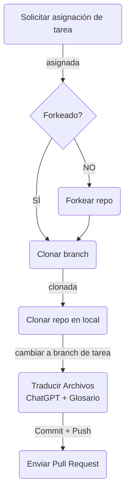

# qwik-i18n-translate-es
Spanish Translation documentation from Official Qwik Documentation

## Guía de contribución

Únete al canal en español de [Discord Builder.io/Qwik](https://qwik.builder.io/chat) en donde podrás compartirnos tus ideas.

### Envío de Pull Requests

1. Busca una tarea pendiente, ábrela y solicita que se te asigne. [Proyecto Qwik ES](https://github.com/orgs/Qwik-Spanish/projects/4/views/1). Debes etiquetar a [@mugan86](https://github.com/mugan86), [@manuelsanchez2](https://github.com/manuelsanchez2) o [@leifermendez](https://github.com/leifermendez).
2. Una vez asignada, haz un Fork del repositorio en tu propia cuenta.
3. Dirígete a branches, presiona en New branch (crear branch) con las siguientes configuraciones:
    * Branch source: [Qwik-Spanish/qwik-i18n-translate-es/](https://github.com/Qwik-Spanish/qwik-i18n-translate-es/)
    * Branch: tu tarea (p. ej. **docs/00-nombre-seccion**)
4. Clona el repositorio bifurcado en tu equipo de forma local y dirígete a la branch correspondiente a tu tarea:
    * `git clone <URL>`
    * `cd qwik-i18n-translate-es/`
    * `git branch -a` para ver las branches disponibles.
    * `git checkout docs/00-nombre-seccion`
6. Abre los archivos index.mdx de cada subsección para que puedas traducirlos (p. ej. `cd \(qwik\)/seccion/subseccion/index.mdx`)
7. Para la traducción, actualmente estamos utilizando el siguiente **prompt** y pasándolo a [ChatGPT](https://chat.openai.com/):
    * *Hola ChatGPT, necesito que seas mi traductor de inglés al español profesional y que me ayudes con la traducción profesional de varios textos de documentación técnica de software. Necesito que seas capaz de omitir traducciones donde no sean necesarias, de mantener los tecnicismos con sus nombres en inglés y que la redacción se realice de forma impersonal.*
    * Luego de utilizar el prompt, traducir el texto por partes puede ser conveniente para no saturar el servicio.
    * Utiliza esta frase para cada parte que se le pase al chat: "Traduce esto por favor: ...pegar parte del texto..."
8. La traducción la realizará la IA y nuestra responsabilidad recae en revisar las traducciones.
9. Se deben realizar correcciones de acuerdo con los términos importantes en el siguiente [Glosario de Qwik ES](https://docs.google.com/spreadsheets/d/1awVY8MFN2pQK5ID2FM8SPMF11ks8qCk_oAdCJH7ObE0/edit#gid=0):
    * Se deben anotar aquellos que aún no están y que se consideren importantes. (En cada subsección pueden haber términos específicos, es necesario anotarlos).
    * Se ha convenido que los términos en inglés deben tener preferencia por sobre las traducciones al español, siempre que sea posible, porque facilitan buscar información.
    * Revisar la términología, la puntuación y la coherencia del texto. Lo fundamental de realizar traducciones es que sea fácil de entender por el lector (legibilidad).
10. Realiza un commit con un mensaje que incluya el nombre de la sección, puedes revisar [commits](https://github.com/Qwik-Spanish/qwik-i18n-translate-es/commits/main) anteriores para tener una referencia. Se recomienda utilizar "Commitizen".
11. Haz push de tu rama a GitHub: `git push origin docs/00-nombre-seccion`.
12. En GitHub, envía la Pull Request (PR) al repositorio principal [Qwik-Spanish/qwik-i18n-translate-es/](https://github.com/Qwik-Spanish/qwik-i18n-translate-es/).
13. Puedes solicitar revisión y una vez que la branch sea aprobada se incluirá (merge) en la principal (main).

### Flujo simple

